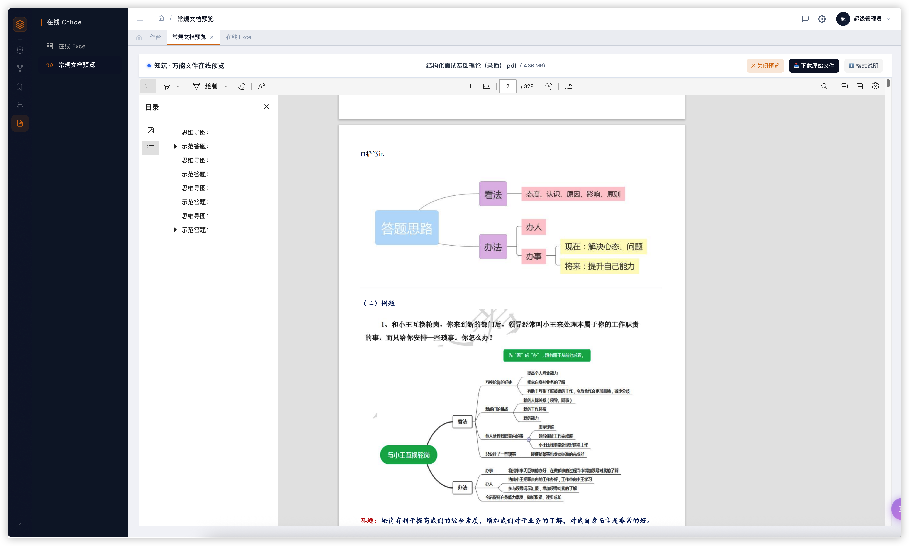
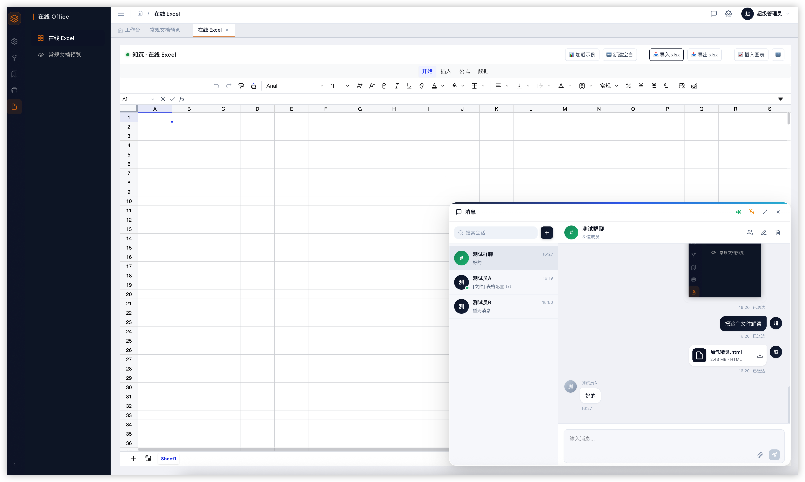
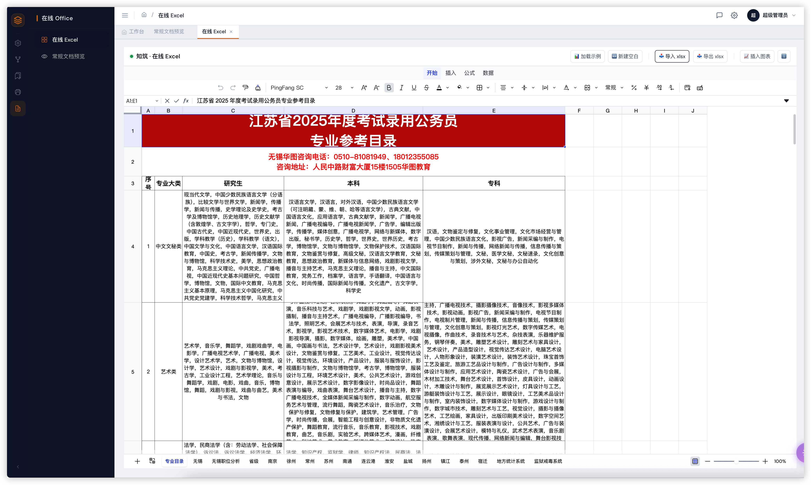

<div align="center">

# 🚀 SunForm-NestAI

### NestJS version of "RuoYi": an enterprise-grade RBAC full-stack scaffold for the AI era

[](LICENSE)
[](https://nodejs.org)
[](https://nestjs.com)
[](https://vuejs.org)
[](https://www.typescriptlang.org)
[](https://www.postgresql.org)
[](https://github.com/pgvector/pgvector)

[English](./README.md) · [简体中文](./README.zh-CN.md) · [Quick Start](#-quick-start) · [Feature Matrix](#-feature-matrix) · [Screenshots](#-screenshots)

</div>

---

## 💡 Why this project

> **In the AI era, every developer has to be full-stack.**

Since 2024, AI coding tools like GitHub Copilot, Cursor, and Claude can read an entire codebase, generate a full CRUD module from a single natural-language sentence, and move seamlessly between frontend and backend.

**The line between frontend and backend is dissolving.** A backend dev should be able to tweak a UI interaction with ease. A frontend dev should be able to read a NestJS controller, a TypeORM entity, or a PostgreSQL index without flinching.

But that only works when the **infrastructure** is solid — strong types, clean layering, AI-friendly code organization, a well-defined project structure. That's what `SunForm-NestAI` is for:

- 🟦 **NestJS + Vue 3 + TypeScript end-to-end** — one language, one mindset, type-safe across the stack
- 🟩 **"RuoYi-style" turnkey RBAC** — users / roles / menus / departments / data permissions, zero config to start
- 🟧 **AI-native** — chat, agent tool-calling, MCP protocol, RAG knowledge base all built in; keeps you on the 2025+ stack
- 🟪 **Business-friendly** — low-code designer, workflow engine, print templates, vector retrieval — covers the common enterprise back-office scenarios

> If you are used to **RuoYi (若依)** and want to stay in the TypeScript / Node ecosystem;
> If you want backend devs to be able to touch the frontend, and frontend devs to read the backend with no friction;
> If you want a single scaffold that runs **AI / RAG / Agent / low-code** out of the box —
> **this project is for you.**

> ⚠️ **This is not a framework.** It is a curated **integration of best practices**. Every key piece uses community-maintained, mainstream solutions: official NestJS modules, Sequelize, pgvector, MCP SDK, Vue Flow, Naive UI. Swap any of them at zero cost.

---

## ✨ Highlights

| Capability | Description |
|------|------|
| 🔐 **Full RBAC** | 7 tables (user / role / menu / department / post / staff / dict) fully wired, 5-level data scope |
| 🧠 **AI full-stack** | AI chat (streaming + auto-continuation), TTS voice cloning, agent tool-calling, RAG vector retrieval — all integrated |
| 🔌 **MCP protocol** | Native [Model Context Protocol](https://modelcontextprotocol.io) support, add / remove MCP servers online |
| 📚 **RAG knowledge base** | pgvector-backed 1536-dim vector retrieval, document chunking + Top-N similarity |
| 🎨 **Low-code** | 4-layer structure (component / page / project / proxy), visual building |
| 🔄 **Workflow engine** | Form & flow decoupled, field-level permissions on nodes, Vue Flow visual editor |
| 🖨 **Print templates** | mm/px-precise JSON template designer, A4 / A5 / A3 all supported |
| 💬 **Real-time chat** | WebSocket-based IM — system users, 1-on-1 and group conversations, typing & read receipts, browser desktop notifications |
| 📊 **Online Excel** | [Univer](https://github.com/dream-num/univer)-powered spreadsheet editor with formula bar, conditional formatting, frozen panes, sheet tabs |
| 📂 **Universal file preview** | Browser-side preview for PDF / Word / image / structured mind-maps — no plugin, no download |
| 🌐 **WeChat Official Account** | OAuth, template messages, customer-service messages, QR codes, JS-SDK — everything you need |
| 🛡 **Security** | Required env vars validated at startup, JWT + Passport, SQL injection surface isolated |
| 📜 **API docs** | Swagger + Knife4j dual stack, auto-synced from comments |

---

## 📸 Screenshots

> All screenshots below are real captures from a running instance using the default **admin / 123456** account.

### 1. Login / System management

|  |  |
|:---:|:---:|
| Login page (dark card + gradient background) | System / Menu management (tree view) |

### 2. Workflow engine (3 steps: form design → flow chart → page design)

|  |  |
|:---:|:---:|
| ① Form field design (fields + field permissions) | ② Flow chart (conditional branches + node permissions) |

|  |  |
|:---:|:---:|
| ③ AI page design assistant (natural language → form page) |  |

### 3. Knowledge base / Print / API docs

|  |  |
|:---:|:---:|
| Knowledge base management + chunk vector details | Print template designer (mm/px + drag-and-drop) |

|  |  |
|:---:|:---:|
| Knife4j API docs (request / response + debugging) |  |

### 4. Online collaboration — file preview / chat / Excel

|  |  |
|:---:|:---:|
| **Universal file preview** — open PDF / Word / image / structured mind-maps in the browser, no download required | **Real-time chat** on WebSocket — system users, 1-on-1 and group conversations, typing & read receipts, browser desktop notifications |

|  |  |
|:---:|:---:|
| **Online Excel** powered by [Univer](https://github.com/dream-num/univer) — formula bar, conditional formatting, frozen panes, sheet tabs, with chat dockable in the corner |  |

---

## 📐 Architecture overview

```
┌──────────────────────────────────────────────────────────────────┐
│                          Browser / Client                          │
│  ┌──────────────────────────────────────────────────────────┐    │
│  │  Vue 3 + Naive UI + Pinia + Vue Router + Vue Flow         │    │
│  │  - Dynamic routes / v-perm directive / 5-level data scope │    │
│  │  - Axios wrapper + business error translation (CN)        │    │
│  └──────────────────────────────────────────────────────────┘    │
└────────────────────────┬─────────────────────────────────────────┘
                         │ /adminApi + /static
                         ▼
┌──────────────────────────────────────────────────────────────────┐
│                      NestJS 11 + TypeScript                       │
│  ┌─────────────┐  ┌──────────────┐  ┌────────────────────────┐  │
│  │ Interceptor │  │   Guards     │  │     Filters            │  │
│  │ Transform   │  │  JWT/Role    │  │  Validation/Any        │  │
│  │  + UserId   │  │  + DataScope │  │                        │  │
│  └─────────────┘  └──────────────┘  └────────────────────────┘  │
│                                                                   │
│  system/*     modules/*      common/*       util/*                │
│  - auth       - ai           - base         - util.service        │
│  - user       - agent        - interceptors - request-proxy      │
│  - role       - knowledge    - filters                          │
│  - menu       - lowcode      - decorators                        │
│  - dept       - wechat       - exceptions                        │
│  - post       - onboarding                                     │
│  - staff      - user-survey                                     │
│  - dict       - workflow                                        │
└─────────────┬─────────────────────────┬───────────────────────────┘
              │                         │
              ▼                         ▼
   ┌────────────────────┐    ┌──────────────────────┐
   │ PostgreSQL 14+     │    │ Redis 7              │
   │ + pgvector ext     │    │ cache / session / RL  │
   └────────────────────┘    └──────────────────────┘
              ▲
              │ HTTP (OpenAI-compatible)
              │
   ┌──────────┴──────────┐
   │  LLM Provider       │  ←  OpenAI / DeepSeek / Moonshot / any OpenAI-compatible service
   │  Embedding Provider │  ←  OpenAI text-embedding-3 / any compatible service
   │  MCP Servers (stdio)│  ←  filesystem / fetch / database / your own MCP services
   └─────────────────────┘
```

---

## 🧩 Tech stack

### Backend
| Tech | Use |
|------|------|
| **NestJS 11** | Core framework (modules + DI + Guards/Interceptors/Filters) |
| **TypeScript 5** | End-to-end type safety |
| **Sequelize 6** | ORM (PostgreSQL dialect) |
| **PostgreSQL 14+ + pgvector** | Relational + vector hybrid storage |
| **Redis 7** | Cache + session |
| **JWT + Passport** | Auth |
| **@nestjs/swagger + nestjs-knife4j2** | API docs |
| **@modelcontextprotocol/sdk** | MCP protocol |
| **@nestjs/config** | Env vars (required keys validated at startup) |
| **Axios** | External HTTP (LLM / file service) |
| **class-validator / class-transformer** | DTO validation |
| **Sequelize + pgvector** | Vector retrieval |

### Frontend
| Tech | Use |
|------|------|
| **Vue 3** | Composition API |
| **Naive UI** | Component library (TypeScript-friendly) |
| **Pinia** | State management |
| **Vue Router 4** | Dynamic routes + guards |
| **Vue Flow** | Workflow engine visual editor |
| **Axios** | HTTP wrapper (with localized error messages) |
| **Tailwind CSS** | Atomic styling |
| **Vite 5** | Build tool |

---

## 📂 Project structure

```
sunform-nest-ai/
├── src/                          # Backend NestJS source
│   ├── common/                   # Base classes / interceptors / filters / decorators
│   ├── env.ts                    # ⚡ dotenv + startup validation (must be imported first)
│   ├── system/                   # System core (RBAC)
│   │   ├── auth/                 #   JWT login / auth + DataScope
│   │   ├── user/  role/  menu/   #   user / role / menu
│   │   ├── department/           #   department (tree)
│   │   ├── post/  staff/         #   post / staff
│   │   ├── dict/                 #   dict (tree + multi-type)
│   │   └── workflow/             #   workflow engine
│   ├── modules/                  # Business modules
│   │   ├── ai/                   #   AI chat / TTS / voice clone
│   │   ├── agent/                #   Agent + MCP + Skills
│   │   ├── knowledge/            #   RAG vector knowledge base (pgvector)
│   │   ├── lowcode/              #   Low-code platform (project / page / component / proxy)
│   │   ├── wechat/               #   WeChat Official Account
│   │   ├── onboarding/           #   Onboarding management
│   │   └── user-survey/          #   Survey
│   ├── util/  utils/             # Utilities
│   ├── app.module.ts
│   └── main.ts
├── front_end/                    # Frontend Vue 3 project
│   └── src/
│       ├── api/                  #  Axios wrapper + localized error translation
│       ├── components/           #  Common components (SyTable / SyForm / SyCard)
│       ├── layout/               #  Layout (sidebar / topbar / tabs)
│       ├── router/               #  Dynamic route guard
│       ├── store/                #  Pinia
│       ├── utils/                #  Utility functions
│       └── views/
│           ├── login/  dashboard/  error/
│           ├── system/           #   System management
│           │   ├── user/ role/ menu/ department/ staff/ post/ dict/
│           │   └── tools/        #   backup / log / settings
│           ├── modules/          #   Business modules
│           │   ├── knowledge/ onboarding/ user-survey/
│           ├── workflow/         #   workflow (template / form-def / instance / task)
│           ├── print/            #   Print template designer
│           └── voice/            #   voice / TTS
├── scripts/
│   ├── deploy.js                 # One-click packaging (frontend → backend → dist)
│   ├── copy-package.js           # Generate slim prod package.json
│   ├── db-init.ts                # One-click DB init (recommended)
│   ├── init-admin.ts             # Init super-admin only (legacy)
│   ├── sync-db.ts                # Field backfill
│   ├── drop-all-tables.ts        # Drop all tables
│   └── import-mysql-json.ts      # MySQL JSON import into PG
├── db/
│   └── seed.sql                  # Initial data (department / role / menu / super-admin)
├── docs/
│   └── screenshots/              # README screenshots (login / workflow / knowledge / print / API)
├── public/                       # Static assets
│   ├── admin/                    # Frontend build output (gitignored)
│   └── lowcode/                  # Low-code uni-app designer
├── .env.example                  # Env var template
└── README.md
```

---

## 📊 Feature matrix

### 🖥 Backend modules

| Module | Sub-capabilities | Endpoint prefix |
|------|--------|---------|
| **Auth** | Login, JWT sign / verify, Passport strategy | `/adminApi/auth/*` |
| **User** | CRUD + MD5 password + role binding | `/adminApi/user/*` |
| **Role** | CRUD + role-menu + role-department + 5-level data scope | `/adminApi/role/*` |
| **Menu** | Tree CRUD + route meta + button-level permissions | `/adminApi/menu/*` |
| **Department** | Tree CRUD + unique code | `/adminApi/department/*` |
| **Staff** | CRUD + linked to department / post | `/adminApi/staff/*` |
| **Post** | CRUD | `/adminApi/post/*` |
| **Dict** | Tree + multi-type (list/tree) | `/adminApi/dict/*` |
| **AI chat** | Streaming chat / completions / multi-rule / auto-continue | `/adminApi/ai/*` |
| **AI voice** | TTS / voice clone | `/adminApi/ai/cloneVoice,textToSpeech` |
| **Agent** | Conversation management + tool calls + context compression + attachments | `/adminApi/agent/*` |
| **MCP protocol** | Add / remove stdio MCP servers online | `/adminApi/agent/mcp/*` |
| **RAG knowledge base** | KB CRUD + doc chunking + 1536-dim vector retrieval | `/adminApi/knowledge/*` |
| **Low-code** | Project / page / component / proxy config | `/adminApi/lowcode/*` |
| **Workflow** | Template / form / instance / task / field permissions | `/adminApi/workflow/*` |
| **WeChat** | OAuth / access_token / template msg / customer msg / QR / JS-SDK | `/adminApi/wechat/*` |
| **Onboarding / Survey** | CRUD | `/adminApi/onboarding,userSurvey/*` |

### 🎨 Frontend pages

| Level 1 | Level 2 | Notes |
|------|------|------|
| Login | Login / logout | JWT persistence + 401 auto-redirect |
| Dashboard | Dashboard | Stat cards / quick entries |
| System | User / Role / Menu / Department / Staff / Post / Dict | Full CRUD + linked config |
| System tools | Backup / Log / Settings | Ops |
| AI | Chat / rule selector | Streaming + context |
| Agent | Session / tool config | MCP service online management |
| Knowledge | KB list / Doc mgmt / Chunk viewer | Upload → chunk → retrieve |
| Low-code | Project / Page / Component | Visual design |
| Workflow | Template / Form / Instance / Task | Vue Flow visual |
| Print | Template design / preview | mm/px precise layout |
| Voice | TTS preview / Clone | MiniMax integration |
| Error | 404 / 500 | Generic error pages |

---

## 🚀 Quick start

### 1. Prerequisites

- Node.js >= 18
- PostgreSQL >= 14 (needs the `vector` extension: `CREATE EXTENSION IF NOT EXISTS vector;`)
- Redis >= 6
- An OpenAI-compatible LLM service (DeepSeek / Moonshot / self-hosted all work)

### 2. Clone & install

```bash
git clone https://github.com/Everyer/sunform-nest-ai.git
cd sunform-nest-ai

# Backend
npm install

# Frontend
cd front_end && npm install && cd ..
```

### 3. Configure env vars

```bash
cp .env.example .env
# Edit .env, at minimum fill in:
#   DATABASE_HOST / DATABASE_PASSWORD / JWT_SECRET / AI_AGENT_API_KEY
```

See [`.env.example`](.env.example) for the full list. **Required keys are validated at startup** — startup fails with a clear message if anything is missing.

### 4. Initialize the database (one command)

#### 4.1 Prepare PostgreSQL

RAG depends on the [`pgvector`](https://github.com/pgvector/pgvector) extension. Make sure your PG instance has it installed:

```bash
# macOS (Homebrew + Postgres.app)
brew install pgvector
# Or build from source: https://github.com/pgvector/pgvector#installation

# Docker (easiest, recommended)
docker run -d --name pg \
  -e POSTGRES_PASSWORD=123456 \
  -p 5432:5432 \
  pgvector/pgvector:pg16
```

Then enable the extension in your target database (the `db-init` script will try `CREATE EXTENSION IF NOT EXISTS vector` automatically, but the PG instance itself must support it):

```sql
-- Run once in the target database
CREATE EXTENSION IF NOT EXISTS vector;
```

> ⚠️ Cloud databases (Aliyun RDS / Tencent Cloud / Supabase) usually have pgvector available in their plugin marketplace — enable it with one click.

#### 4.2 Run the init script

```bash
npm run db:init
```

The script [`scripts/db-init.ts`](scripts/db-init.ts) does the following in order:

| # | Step | Description |
|---|------|------|
| 1 | **DROP SCHEMA public CASCADE** | Wipe the public schema for a clean slate |
| 2 | **CREATE EXTENSION vector** | Enable pgvector (clear guidance if it fails) |
| 3 | **Sequelize.sync({ force: true })** | Scan `src/**/*.entity.ts` and auto-create tables (**entity is the source of truth, no hand-written DDL**) |
| 4 | **Run `db/seed.sql`** | Insert 1 department / 1 post / 1 staff / 1 role / 18 menus |
| 5 | **Create default super-admin** | Account `admin` / password `123456` (MD5 hash) |

> ⚠️ **The script wipes the entire public schema.** Do not run it on production casually. Use only for **first deployment** or **full data reset**.

#### 4.3 Common init failures

| Error | Cause | Fix |
|------|------|------|
| `type "vector" does not exist` | pgvector not installed on PG instance | See 4.1 |
| `permission denied for schema public` | DB user lacks superuser | `GRANT ALL ON SCHEMA public TO your_user;` |
| `connect ECONNREFUSED 127.0.0.1:5432` | Local PG not running | `brew services start postgresql@16` |
| `password authentication failed` | Wrong password in `.env` | Check `DATABASE_PASSWORD` |
| `relation "users" does not exist` (after `nest start`) | Skipped `db-init` and started nest directly | Run `npm run db:init` first, then `npm run start:dev` |

> Need a **remote / shared PG**? Just edit `DATABASE_HOST` / `DATABASE_PORT` / `DATABASE_USERNAME` / `DATABASE_PASSWORD` / `DATABASE_NAME` in `.env` (a remote example is already commented in the file) and re-run `npm run db:init`.

### 5. Start dev servers

```bash
# Terminal 1: backend (port 9528)
npm run start:dev

# Terminal 2: frontend (port 9526)
cd front_end && npm run dev
```

Default account: `admin` / `123456` (change immediately in production)

Visit:
- Frontend: http://localhost:9526
- Knife4j API docs: http://localhost:9528/doc.html
- Swagger JSON: http://localhost:9528/api-json

### 6. Plug in MCP (Agent module)

The agent module natively supports [Model Context Protocol](https://modelcontextprotocol.io). Create `.agent/.mcp.json` at the project root (already in `.gitignore`):

```json
{
  "mcpServers": {
    "filesystem": {
      "command": "npx",
      "args": ["-y", "@modelcontextprotocol/server-filesystem", "/your/safe/dir"],
      "type": "stdio"
    }
  }
}
```

Or add / remove dynamically via the online API `POST /adminApi/agent/mcp/config/add`. Restart the service to take effect.

---

## 🔐 RBAC

### Data model

```
User ─(UserRole)─→ Role ─(RoleMenu)─→ Menu
                  Role ─(RoleDepartment)─→ Department
                  Menu.type ∈ { menu, comp }   ← route / button level
                  Role.dataScope ∈ { 0,1,2,3,4 } ← 5-level data scope
```

### Data scope

| Value | Meaning | Typical use |
|----|------|----------|
| 0 | Self only | Regular employee |
| 1 | Department and below | Department lead |
| 2 | Department only | Department clerk |
| 3 | Custom department | Cross-department lead |
| 4 | All data | Super admin |

### Auth flow

```
Request comes in
  ├─ JWT Guard      → parse token, write req.user
  ├─ Roles Guard    → check @Roles decorator
  ├─ DataScope      → inject dataScope filter
  ├─ Controller     → handle business
  └─ Transform Int. → uniform response { code, success, message, data }
```

---

## 🔌 AI capabilities in detail

### AI chat (`/adminApi/ai/stream`)

- OpenAI-compatible: just fill in `AI_AGENT_BASE_URL` + `AI_AGENT_MODEL`
- Auto-continuation: when long output is truncated, it auto-continues
- Context compression: auto-summarize when token limit is exceeded
- Multi-rule switch: code / customer-service / low-code / custom prompt

### Agent (`/adminApi/agent/*`)

- Multi-turn conversation management (with history persistence)
- Built-in tools: file read / write, command execution, directory listing
- Auto tool discovery (from MCP)
- Conversation compression (by token estimate)
- Attachment upload + image-understanding hint

### RAG knowledge base

- Document chunking (recursive semantic splitter with overlap)
- 1536-dim vectors (pgvector `vector(1536)`)
- Top-N similarity retrieval (cosine distance)
- Graceful fallback: when embedding is unavailable, falls back to local deterministic vectors

### Voice (TTS / clone)

- TTS: text → speech (`/adminApi/ai/textToSpeech`)
- Clone: reference audio + text → new voice (`/adminApi/ai/cloneVoice`)

---

## 🛠 Common commands

```bash
# Backend
npm run start:dev          # Dev mode (watch)
npm run build              # Build backend only
npm run deploy             # One-click package: frontend → backend → dist
npm run lint               # ESLint check
npm run format             # Prettier format
npm run sync:db            # DB field backfill

# Frontend
cd front_end
npm run dev                # Dev server
npm run build              # Production build
npm run preview            # Preview build
```

---

## 🚢 Deployment

```bash
# One-click package
npm run deploy
# Output in dist/

# Upload to server
scp -r dist/ user@server:/app/

# On the server
cd /app/dist
npm install --omit=dev
vim .env   # Switch to production config
node main.js
```

---

## 🗺 Roadmap

- [ ] Full test coverage (e2e currently empty)
- [ ] UI-ified field-level permissions in workflow
- [ ] Knowledge base visualization (chunk highlight, citation trace)
- [ ] Multi-agent collaboration (Plan-Execute mode)
- [ ] Low-code component marketplace
- [ ] Helm Chart / Docker Compose one-click deploy
- [ ] i18n

---

## 🤝 Contributing

PRs and issues are welcome. **Especially welcome:**

- New MCP server integration examples
- New low-code components
- Best-practice patterns for business modules
- Prompt optimization for AI rules

Before submitting, run `npm run lint` + `npm run build` to make sure CI is green.

---

## 📄 License

[MIT](LICENSE) — free to use, modify, commercially.

---

## 🙏 Acknowledgments

Standing on the shoulders of giants:

- [RuoYi (若依)](https://gitee.com/y_project/RuoYi) — RBAC & permission design inspiration
- [NestJS](https://nestjs.com) / [Vue 3](https://vuejs.org) / [Naive UI](https://www.naiveui.com) — first-class engineering foundation
- [pgvector](https://github.com/pgvector/pgvector) — vector retrieval inside PG
- [Model Context Protocol](https://modelcontextprotocol.io) — standard protocol for tool calls
- [Vue Flow](https://vueflow.dev) — workflow engine canvas

---

## 💬 Community

> Questions / ideas / feature requests — feel free to join 👇

**QQ group: `330903359`**

---

<div align="center">
If this project helps you, a ⭐ Star is appreciated!<br>
<sub>Built with ❤️ for the AI era, where everyone ships full-stack.</sub>
</div>
