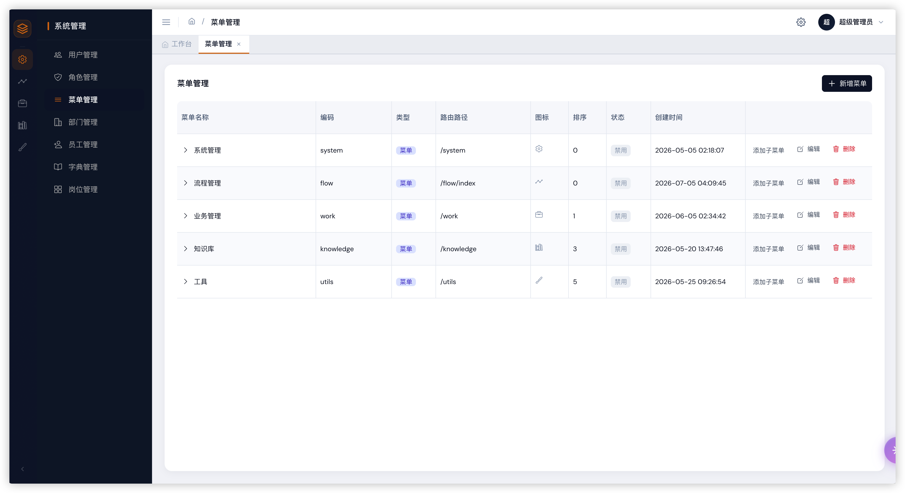
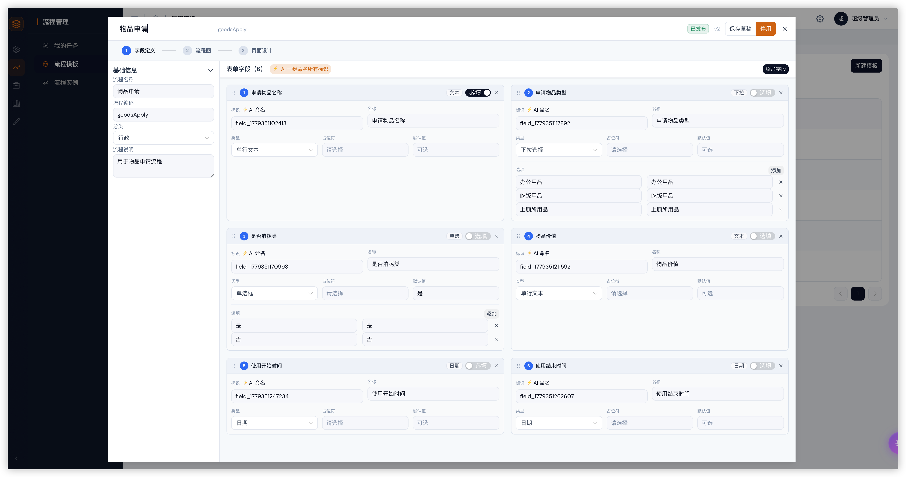
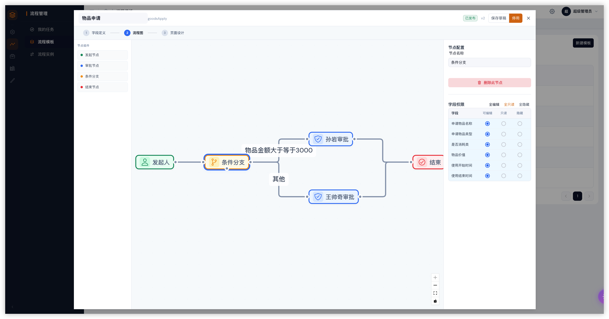
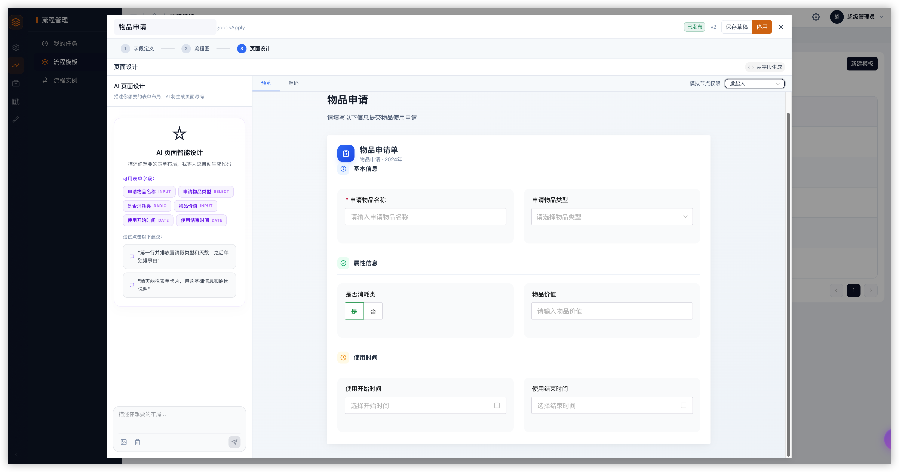
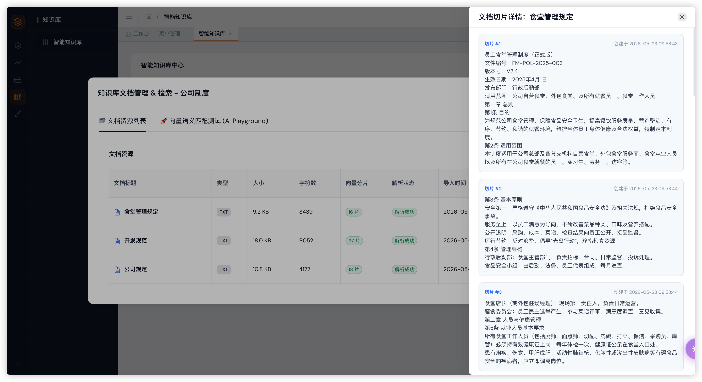
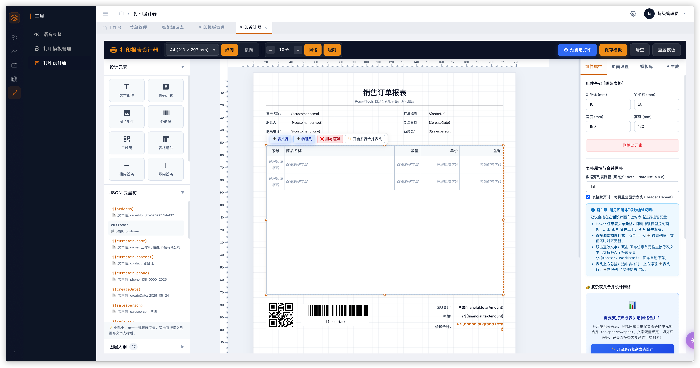
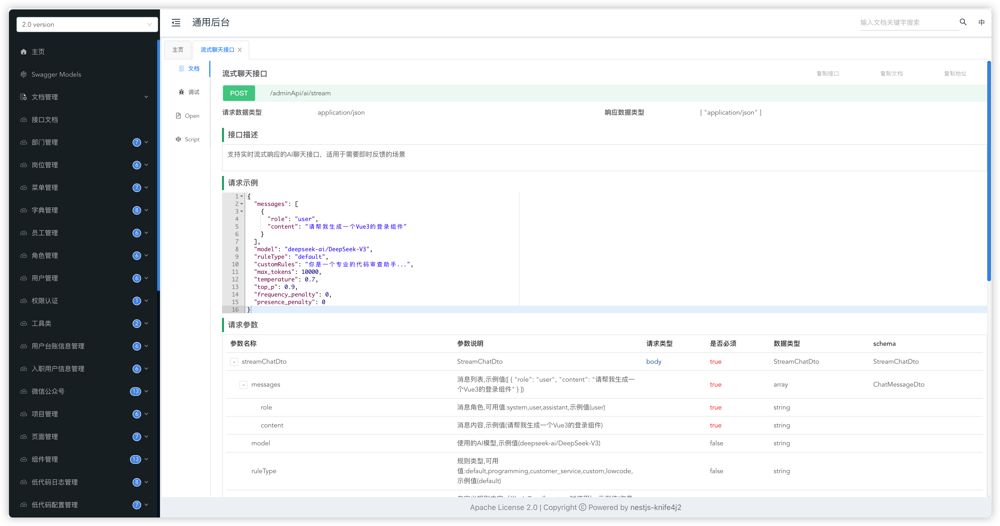

<div align="center">

# 🚀 SunForm-NestAI

### NestJS 版的「若依」：AI 时代的企业级 RBAC 全栈脚手架

[](LICENSE)
[](https://nodejs.org)
[](https://nestjs.com)
[](https://vuejs.org)
[](https://www.typescriptlang.org)
[](https://www.postgresql.org)
[](https://github.com/pgvector/pgvector)

[English](./README.md) · 简体中文 · [快速开始](#-快速开始) · [功能矩阵](#-功能矩阵) · [截图预览](#-截图预览)

</div>

---

## 💡 创作初心

> **AI 时代，要求每个人都是全栈。**

2024 年开始，GitHub Copilot、Cursor、Claude 这些 AI 编码工具已经能读懂整个代码库、能根据一句自然语言描述生成完整的 CRUD 模块、能在前后端之间游走。

**前端后端的边界正在消融。** 一个后端开发者应该能轻松改前端交互，一个前端开发者也应该能轻松看懂 NestJS 控制器、TypeORM 实体、PostgreSQL 索引。

但这件事需要**基础设施的支撑** —— 强类型、良好分层、AI 友好的代码组织、规范的项目结构。这是 `SunForm-NestAI` 的存在意义：

- 🟦 **NestJS + Vue 3 + TypeScript 贯穿前后端** —— 一套语言、一种思维、端到端类型安全
- 🟩 **类似若依的"开箱即用 RBAC"** —— 用户/角色/菜单/部门/数据权限，零配置上手
- 🟧 **AI 原生** —— AI 对话、Agent 工具调用、MCP 协议、RAG 知识库全部内置，跟上 2025+ 技术栈
- 🟪 **业务友好** —— 低代码设计器、工作流引擎、打印模板、向量化检索，覆盖企业后台的常见场景

> 如果你用 **若依（RuoYi）** 习惯了，又想用 TypeScript / Node 生态；
> 如果你想让后端同事能轻松改前端、前端同事能轻松改后端；
> 如果你想在一套脚手架里就把 **AI / RAG / Agent / 低代码** 全部跑通——
> **这个项目就是为你准备的。**

> ⚠️ **本项目不试图做框架**，而是做"一套**工程化最佳实践的整合**"。所有关键能力都用社区主流方案：NestJS 官方模块、Sequelize、pgvector、MCP SDK、Vue Flow、Naive UI。你可以零成本替换任何一块。

---

## ✨ 核心亮点

| 能力 | 说明 |
|------|------|
| 🔐 **完整 RBAC** | 用户 / 角色 / 菜单 / 部门 / 岗位 / 员工 / 字典 7 张表全打通，5 级数据权限 |
| 🧠 **AI 全栈** | AI 对话（流式+续写）、TTS 语音克隆、Agent 工具调用、RAG 向量检索一体 |
| 🔌 **MCP 协议** | 原生支持 [Model Context Protocol](https://modelcontextprotocol.io)，可在线增删 MCP 服务器 |
| 📚 **RAG 知识库** | 基于 pgvector 的 1536 维向量检索，文档切片 + 相似度 Top-N |
| 🎨 **低代码** | 组件 / 页面 / 项目 / 代理四层结构，可视化搭建 |
| 🔄 **工作流引擎** | 表单与流程解耦，节点字段级权限，Vue Flow 可视化编辑 |
| 🖨 **打印模板** | mm/px 精确换算的 JSON 模板设计器，A4/A5/A3 全支持 |
| 🌐 **微信公众号** | OAuth、模板消息、客服消息、二维码、JS-SDK 一应俱全 |
| 🛡 **安全** | 启动时校验必需 env、JWT + Passport、SQL 注入面已隔离 |
| 📜 **API 文档** | Swagger + Knife4j 双栈，自动同步注释 |

---

## 📸 截图预览

> 截图全部基于 **admin / 123456** 默认账号的真实运行效果。

### 1. 登录 / 系统管理

|  |  |
|:---:|:---:|
| 登录页（深色卡片 + 渐变背景） | 系统管理 / 菜单管理（树形） |

### 2. 工作流引擎（3 步：表单设计 → 流程图 → 页面设计）

|  |  |
|:---:|:---:|
| ① 表单字段设计（表单项 + 字段权限） | ② 流程图（条件分支 + 节点权限配置） |

|  |  |
|:---:|:---:|
| ③ AI 页面设计助手（自然语言 → 表单页） |  |

### 3. 知识库 / 打印 / 接口文档

|  |  |
|:---:|:---:|
| 知识库管理 + 文档切片向量详情 | 打印模板设计器（mm/px + 拖拽组件） |

|  |  |
|:---:|:---:|
| Knife4j 接口文档（请求/响应 + 调试） |  |

---

## 📐 架构概览

```
┌──────────────────────────────────────────────────────────────────┐
│                          浏览器 / 客户端                            │
│  ┌──────────────────────────────────────────────────────────┐    │
│  │  Vue 3 + Naive UI + Pinia + Vue Router + Vue Flow         │    │
│  │  - 动态路由 / v-perm 指令 / 5 级数据权限 UI 适配              │    │
│  │  - axios 封装 + 业务错误中文翻译（保姆级提示）                │    │
│  └──────────────────────────────────────────────────────────┘    │
└────────────────────────┬─────────────────────────────────────────┘
                         │ /adminApi + /static
                         ▼
┌──────────────────────────────────────────────────────────────────┐
│                      NestJS 11 + TypeScript                       │
│  ┌─────────────┐  ┌──────────────┐  ┌────────────────────────┐  │
│  │  Interceptor│  │   Guards     │  │     Filters            │  │
│  │ Transform   │  │  JWT/Role    │  │  Validation/Any        │  │
│  │  + UserId   │  │  + DataScope │  │                        │  │
│  └─────────────┘  └──────────────┘  └────────────────────────┘  │
│                                                                   │
│  system/*     modules/*      common/*       util/*                │
│  - auth       - ai           - base         - util.service        │
│  - user       - agent        - interceptors - request-proxy       │
│  - role       - knowledge    - filters                          │
│  - menu       - lowcode      - decorators                        │
│  - dept       - wechat       - exceptions                        │
│  - post       - onboarding                                     │
│  - staff      - user-survey                                     │
│  - dict       - workflow                                        │
└─────────────┬─────────────────────────┬───────────────────────────┘
              │                         │
              ▼                         ▼
   ┌────────────────────┐    ┌──────────────────────┐
   │ PostgreSQL 14+     │    │ Redis 7              │
   │ + pgvector ext     │    │ 缓存/会话/限流         │
   └────────────────────┘    └──────────────────────┘
              ▲
              │ HTTP (OpenAI 兼容协议)
              │
   ┌──────────┴──────────┐
   │  LLM Provider       │  ←  OpenAI / DeepSeek / Moonshot / 任何 OpenAI 兼容服务
   │  Embedding Provider │  ←  OpenAI text-embedding-3 / 任何兼容服务
   │  MCP Servers (stdio)│  ←  filesystem / fetch / database / 你写的任何 MCP 服务
   └─────────────────────┘
```

---

## 🧩 技术栈

### 后端
| 技术 | 用途 |
|------|------|
| **NestJS 11** | 核心框架（模块化 + DI + Guards/Interceptors/Filters）|
| **TypeScript 5** | 端到端类型安全 |
| **Sequelize 6** | ORM（已切到 PostgreSQL 方言）|
| **PostgreSQL 14+ + pgvector** | 关系型 + 向量混合存储 |
| **Redis 7** | 缓存 + 会话 |
| **JWT + Passport** | 鉴权 |
| **@nestjs/swagger + nestjs-knife4j2** | API 文档 |
| **@modelcontextprotocol/sdk** | MCP 协议 |
| **@nestjs/config** | 环境变量（启动时校验必需 key）|
| **Axios** | 外部 HTTP（含 LLM / 文件服务）|
| **class-validator / class-transformer** | DTO 校验 |
| **Sequelize + pgvector** | 向量检索 |

### 前端
| 技术 | 用途 |
|------|------|
| **Vue 3** | Composition API |
| **Naive UI** | 组件库（TypeScript 友好）|
| **Pinia** | 状态管理 |
| **Vue Router 4** | 动态路由 + 守卫 |
| **Vue Flow** | 流程引擎可视化编辑 |
| **Axios** | HTTP 封装（含中文错误翻译）|
| **Tailwind CSS** | 原子化样式 |
| **Vite 5** | 构建工具 |

---

## 📂 项目结构

```
sunform-nest-ai/
├── src/                          # 后端 NestJS 源码
│   ├── common/                   # 基类 / 拦截器 / 过滤器 / 装饰器
│   ├── env.ts                    # ⚡ dotenv + 启动校验（必须第一个 import）
│   ├── system/                   # 系统核心层（RBAC）
│   │   ├── auth/                 #   JWT 登录/鉴权 + DataScope
│   │   ├── user/  role/  menu/   #   用户/角色/菜单
│   │   ├── department/           #   部门（树形）
│   │   ├── post/  staff/         #   岗位 / 员工
│   │   ├── dict/                 #   字典（树形 + 多类型）
│   │   └── workflow/             #   流程引擎
│   ├── modules/                  # 业务模块
│   │   ├── ai/                   #   AI 对话 / TTS / 语音克隆
│   │   ├── agent/                #   Agent + MCP + Skills
│   │   ├── knowledge/            #   RAG 向量知识库（pgvector）
│   │   ├── lowcode/              #   低代码平台（项目/页面/组件/代理）
│   │   ├── wechat/               #   微信公众号
│   │   ├── onboarding/           #   入职管理
│   │   └── user-survey/          #   问卷调研
│   ├── util/  utils/             # 工具
│   ├── app.module.ts
│   └── main.ts
├── front_end/                    # 前端 Vue 3 工程
│   └── src/
│       ├── api/                  #  axios 封装 + 中文错误翻译
│       ├── components/           #  公共组件（SyTable / SyForm / SyCard）
│       ├── layout/               #  布局（侧边栏/顶栏/标签页）
│       ├── router/               #  动态路由守卫
│       ├── store/                #  Pinia
│       ├── utils/                #  工具函数
│       └── views/
│           ├── login/  dashboard/  error/
│           ├── system/           #   系统管理
│           │   ├── user/ role/ menu/ department/ staff/ post/ dict/
│           │   └── tools/        #   备份 / 日志 / 设置
│           ├── modules/          #   业务模块
│           │   ├── knowledge/ onboarding/ user-survey/
│           ├── workflow/         #   流程（template / form-def / instance / task）
│           ├── print/            #   打印模板设计器
│           └── voice/            #   语音 / TTS
├── scripts/
│   ├── deploy.js                 # 一键打包（前端→后端→dist）
│   ├── copy-package.js           # 生成精简 prod package.json
│   ├── db-init.ts                # 一键初始化数据库（推荐）
│   ├── init-admin.ts             # 仅初始化超管（兼容旧流程）
│   ├── sync-db.ts                # 字段补全
│   ├── drop-all-tables.ts        # 清库
│   └── import-mysql-json.ts      # MySQL JSON 导入 PG
├── db/
│   └── seed.sql                  # 初始数据（部门/角色/菜单/超管）
├── docs/
│   └── screenshots/              # README 截图（登录/工作流/知识库/打印/接口）
├── public/                       # 静态资源
│   ├── admin/                    # 前端构建产物（gitignored）
│   └── lowcode/                  # 低代码 uni-app 设计器
├── .env.example                  # 环境变量模板
└── README.md
```

---

## 📊 功能矩阵

### 🖥 后端模块

| 模块 | 子能力 | 接口前缀 |
|------|--------|---------|
| **认证 (auth)** | 登录、JWT 签发/校验、Passport Strategy | `/adminApi/auth/*` |
| **用户 (user)** | CRUD + 密码 MD5 + 角色绑定 | `/adminApi/user/*` |
| **角色 (role)** | CRUD + 角色-菜单 + 角色-部门 + 5 级数据权限 | `/adminApi/role/*` |
| **菜单 (menu)** | 树形 CRUD + 路由元信息 + 按钮级权限 | `/adminApi/menu/*` |
| **部门 (department)** | 树形 CRUD + 编码唯一 | `/adminApi/department/*` |
| **员工 (staff)** | CRUD + 关联部门/岗位 | `/adminApi/staff/*` |
| **岗位 (post)** | CRUD | `/adminApi/post/*` |
| **字典 (dict)** | 树形 + 多类型（list/tree）| `/adminApi/dict/*` |
| **AI 对话** | 流式 chat / completions / 多规则 / 自动续写 | `/adminApi/ai/*` |
| **AI 语音** | TTS 文字转语音 / 音色克隆 | `/adminApi/ai/cloneVoice,textToSpeech` |
| **Agent** | 对话会话管理 + 工具调用 + 对话压缩 + 文件附件 | `/adminApi/agent/*` |
| **MCP 协议** | 在线增删 stdio MCP 服务器 | `/adminApi/agent/mcp/*` |
| **知识库 RAG** | 知识库 CRUD + 文档切片 + 1536 维向量检索 | `/adminApi/knowledge/*` |
| **低代码** | 项目 / 页面 / 组件 / 代理配置 | `/adminApi/lowcode/*` |
| **工作流** | 模板 / 表单 / 实例 / 任务 / 字段权限 | `/adminApi/workflow/*` |
| **微信** | OAuth / access_token / 模板消息 / 客服消息 / 二维码 / JS-SDK | `/adminApi/wechat/*` |
| **入职 / 问卷** | CRUD | `/adminApi/onboarding,userSurvey/*` |

### 🎨 前端页面

| 一级 | 二级 | 说明 |
|------|------|------|
| 登录 | 登录页 / 退出 | JWT 持久化 + 401 自动跳登录 |
| 工作台 | Dashboard | 统计卡片 / 快捷入口 |
| 系统管理 | 用户 / 角色 / 菜单 / 部门 / 员工 / 岗位 / 字典 | 完整 CRUD + 关联配置 |
| 系统工具 | 备份 / 日志 / 设置 | 运维相关 |
| AI | 对话 / 规则选择 | 流式输出 + 上下文 |
| Agent | 会话 / 工具配置 | MCP 服务在线管理 |
| 知识库 | 知识库列表 / 文档管理 / 切片查看 | 文档上传→切片→检索 |
| 低代码 | 项目 / 页面 / 组件 | 可视化设计 |
| 工作流 | 模板 / 表单 / 实例 / 任务 | Vue Flow 可视化 |
| 打印 | 模板设计 / 预览 | mm/px 精确排版 |
| 语音 | TTS 试听 / 克隆 | 集成 MiniMax |
| 错误 | 404 / 500 | 通用错误页 |

---

## 🚀 快速开始

### 1. 环境准备

- Node.js >= 18
- PostgreSQL >= 14（需 `vector` 扩展：`CREATE EXTENSION IF NOT EXISTS vector;`）
- Redis >= 6
- 一个 OpenAI 兼容的 LLM 服务（也可以是 DeepSeek / Moonshot / 自部署）

### 2. 克隆 & 安装

```bash
git clone https://github.com/your-org/sunform-nest-ai.git
cd sunform-nest-ai

# 后端
npm install

# 前端
cd front_end && npm install && cd ..
```

### 3. 配置环境变量

```bash
cp .env.example .env
# 编辑 .env，至少填好下面几项：
#   DATABASE_HOST / DATABASE_PASSWORD / JWT_SECRET / AI_AGENT_API_KEY
```

完整变量说明见 [`.env.example`](.env.example)。**启动时会自动校验** 必需项，缺配则启动失败并给出明确提示。

### 4. 初始化数据库（一键完成）

#### 4.1 准备 PostgreSQL

RAG 知识库依赖 [`pgvector`](https://github.com/pgvector/pgvector) 扩展，请先确保数据库实例已安装：

```bash
# macOS (Homebrew + Postgres.app)
brew install pgvector
# 或编译安装：https://github.com/pgvector/pgvector#installation

# Docker（最省事，推荐）
docker run -d --name pg \
  -e POSTGRES_PASSWORD=123456 \
  -p 5432:5432 \
  pgvector/pgvector:pg16
```

登录到 PG 启用扩展（`db-init` 脚本会自动尝试 `CREATE EXTENSION IF NOT EXISTS vector`，但需要 PG 实例本身支持）：

```sql
-- 在目标数据库内执行一次即可
CREATE EXTENSION IF NOT EXISTS vector;
```

> ⚠️ 如果是云数据库（阿里云 RDS / 腾讯云 / Supabase），通常在控制台"插件市场"一键启用 pgvector 即可。

#### 4.2 跑初始化脚本

```bash
npm run db:init
```

脚本 [`scripts/db-init.ts`](scripts/db-init.ts) 会按顺序执行：

| # | 步骤 | 说明 |
|---|------|------|
| 1 | **DROP SCHEMA public CASCADE** | 清空整个 public schema，干净环境 |
| 2 | **CREATE EXTENSION vector** | 启用 pgvector（失败会给出明确指引） |
| 3 | **Sequelize.sync({ force: true })** | 扫描 `src/**/*.entity.ts` 自动建表（**实体即真相，无需手写 DDL**） |
| 4 | **执行 `db/seed.sql`** | 写入 1 个部门 / 1 个岗位 / 1 个员工 / 1 个角色 / 18 个菜单 |
| 5 | **创建默认超管** | 账号 `admin` / 密码 `123456`（MD5 哈希） |

> ⚠️ **脚本会清空整个 public schema**，请勿在生产环境随意运行。仅用于**首次部署**或**想要重置全部数据**。

#### 4.3 常见初始化失败

| 报错 | 原因 | 解决 |
|------|------|------|
| `type "vector" does not exist` | PG 实例未安装 pgvector | 见 4.1 启用扩展 |
| `permission denied for schema public` | DB 用户无 superuser 权限 | `GRANT ALL ON SCHEMA public TO your_user;` |
| `connect ECONNREFUSED 127.0.0.1:5432` | 本地 PG 未启动 | `brew services start postgresql@16` |
| `password authentication failed` | `.env` 里密码不对 | 检查 `DATABASE_PASSWORD` |
| `relation "users" does not exist`（在启动 nest 后才报）| 跳过了 db-init 直接启动了 | 先跑 `npm run db:init` 再 `npm run start:dev` |

> 想连接**远程 / 共享 PG**？直接改 `.env` 里的 `DATABASE_HOST` / `DATABASE_PORT` / `DATABASE_USERNAME` / `DATABASE_PASSWORD` / `DATABASE_NAME` 即可（参考 `.env` 里已经预留了 `150.158.93.154/temp` 这种远程配置示例），改完再跑 `npm run db:init`。

### 5. 启动开发服务器

```bash
# 终端 1：后端（9528 端口）
npm run start:dev

# 终端 2：前端（9526 端口）
cd front_end && npm run dev
```

默认账号：`admin` / `123456`（生产环境请立即修改）

访问：
- 前台：http://localhost:9526
- Knife4j 接口文档：http://localhost:9528/doc.html
- Swagger JSON：http://localhost:9528/api-json

### 6. 接入 MCP（Agent 模块）

agent 模块原生支持 [Model Context Protocol](https://modelcontextprotocol.io)。在项目根目录新建 `.agent/.mcp.json`（已在 .gitignore）：

```json
{
  "mcpServers": {
    "filesystem": {
      "command": "npx",
      "args": ["-y", "@modelcontextprotocol/server-filesystem", "/your/safe/dir"],
      "type": "stdio"
    }
  }
}
```

或者通过在线接口 `POST /adminApi/agent/mcp/config/add` 动态增删。重启服务后生效。

---

## 🔐 RBAC 权限体系

### 数据模型

```
User ─(UserRole)─→ Role ─(RoleMenu)─→ Menu
                  Role ─(RoleDepartment)─→ Department
                  Menu.type ∈ { menu, comp }   ← 控制路由/按钮级
                  Role.dataScope ∈ { 0,1,2,3,4 } ← 5 级数据权限
```

### 数据权限范围

| 值 | 含义 | 适用场景 |
|----|------|----------|
| 0 | 本人数据 | 普通员工 |
| 1 | 本部门及下级 | 部门主管 |
| 2 | 本部门 | 部门内勤 |
| 3 | 自定义部门 | 跨部门负责人 |
| 4 | 全部数据 | 超级管理员 |

### 鉴权流程

```
请求进入
  ├─ JWT Guard      → 解析 token，写入 req.user
  ├─ Roles Guard    → 检查 @Roles 装饰器
  ├─ DataScope      → 注入 dataScope 过滤条件
  ├─ Controller     → 处理业务
  └─ Transform Int. → 统一响应格式 { code, success, message, data }
```

---

## 🔌 AI 能力详解

### AI 对话（`/adminApi/ai/stream`）

- 支持 OpenAI 兼容协议：填 `AI_AGENT_BASE_URL` + `AI_AGENT_MODEL` 即可对接任何服务
- 自动续写判定：长输出截断时自动续写
- 上下文压缩：超过 token 上限时自动摘要
- 多规则切换：编程 / 客服 / 低代码 / 自定义 prompt

### Agent（`/adminApi/agent/*`）

- 多轮会话管理（含历史持久化）
- 内置工具：文件读写、命令执行、目录列表
- 工具自动发现（来自 MCP）
- 对话压缩（按 token 估算）
- 附件上传 + 图片理解提示

### 知识库 RAG

- 文档切片（递归语义切分，重叠保留）
- 1536 维向量（pgvector `vector(1536)`）
- 相似度 Top-N 检索（cosine 距离）
- 失败降级：embedding 不可用时回退到本地确定性向量

### 语音（TTS / 克隆）

- TTS：文字→语音（`/adminApi/ai/textToSpeech`）
- 克隆：参考音频 + 文本→新音色（`/adminApi/ai/cloneVoice`）

---

## 🛠 常用命令

```bash
# 后端
npm run start:dev          # 开发模式（watch）
npm run build              # 仅构建后端
npm run deploy             # 一键打包：前端→后端→dist
npm run lint               # ESLint 检查
npm run format             # Prettier 格式化
npm run sync:db            # 数据库字段补全

# 前端
cd front_end
npm run dev                # 开发服务器
npm run build              # 生产构建
npm run preview            # 预览构建结果
```

---

## 🚢 部署

```bash
# 一键打包
npm run deploy
# 产物在 dist/ 目录

# 上传到服务器
scp -r dist/ user@server:/app/

# 服务器上
cd /app/dist
npm install --omit=dev
vim .env   # 改成生产配置
node main.js
```

更多细节见 [`.harness/agent.md`](.harness/agent.md) 中的部署章节（待补）。

---

## 🗺 Roadmap

- [ ] 完整测试覆盖（当前 e2e 留空）
- [ ] 流程引擎字段级权限 UI 化
- [ ] 知识库可视化（Chunk 高亮、引用追溯）
- [ ] Agent 多 Agent 协作（Plan-Execute 模式）
- [ ] 低代码组件市场
- [ ] Helm Chart / Docker Compose 一键部署
- [ ] i18n 国际化

---

## 🤝 贡献指南

欢迎 PR、Issue。**特别欢迎：**

- 新的 MCP 服务器集成示例
- 新的低代码组件
- 业务模块的最佳实践
- AI 规则的 prompt 优化

提交前请跑 `npm run lint` + `npm run build`，确保 CI 绿。

---

## 📄 许可证

[MIT](LICENSE) — 自由使用、商用、修改。

---

## 🙏 致谢

本项目站在巨人的肩膀上：

- [若依 RuoYi](https://gitee.com/y_project/RuoYi) —— RBAC 与权限设计灵感
- [NestJS](https://nestjs.com) / [Vue 3](https://vuejs.org) / [Naive UI](https://www.naiveui.com) —— 一流的工程基础
- [pgvector](https://github.com/pgvector/pgvector) —— 让 PG 跑向量检索
- [Model Context Protocol](https://modelcontextprotocol.io) —— 工具调用的标准协议
- [Vue Flow](https://vueflow.dev) —— 流程引擎画布

---

## 💬 交流社区

> 有问题 / 想交流 / 提需求，欢迎扫码加群 👇

**QQ 群：`330903359`**

---

<div align="center">
如果这个项目对你有帮助，欢迎 ⭐ Star 支持一下！<br>
<sub>Built with ❤️ for the AI era, where everyone ships full-stack.</sub>
</div>
